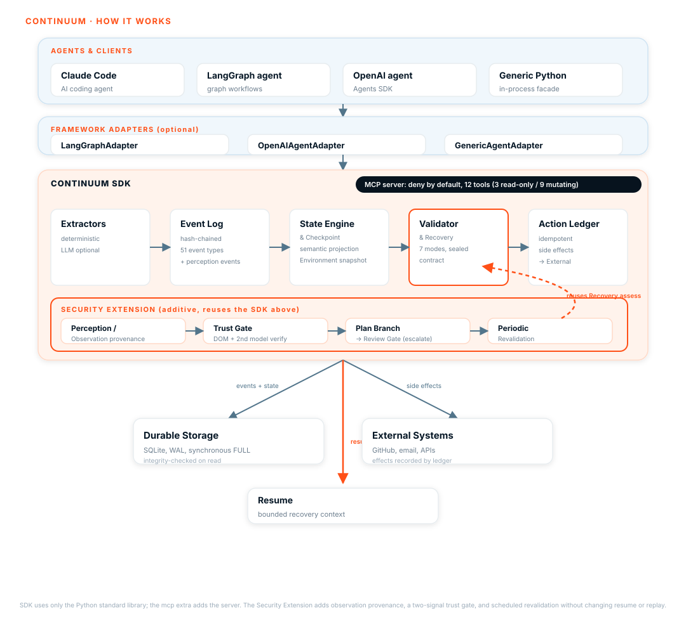

<p align="center">
  
</p>

<p align="center">
  <strong>CONTINUUM: Verifiable semantic recovery for long-running AI agents.</strong>
  Semantic checkpoints (not conversation dumps), an idempotent action ledger
  that refuses duplicate side effects, and a hash-chained tamper-evident event
  log, all exposed as a deny-by-default MCP server. Framework-agnostic,
  Python 3.11+.
</p>

<p align="center">
  <a href="https://www.python.org/downloads/"></a>
  <a href="LICENSE"></a>
  <a href="https://pydantic.dev"></a>
  <a href="https://continuum-nu-six.vercel.app/"></a>
</p>

<p align="center">
  <a href="https://continuum-nu-six.vercel.app/"><strong>Visit the CONTINUUM website</strong></a>
</p>

---

## Contents

[Why](#why) · [Quick Start](#quick-start) · [How it works](#how-it-works) · [Features](#features) · [Security Extension](#security-extension) · [Empirical Verification](#empirical-verification) · [MCP Integration](#mcp-integration) · [Framework Integration](#framework-integration) · [Core Concepts](#core-concepts) · [Architecture](#architecture) · [API and CLI](#api-and-cli) · [Roadmap](#roadmap) · [What CONTINUUM Is Not](#what-continuum-is-not) · [Related work](#related-work) · [Status and limitations](#status-and-limitations) · [Contributing](#contributing) · [License](#license)

---

## Why

Modern AI agents run long tasks (hundreds of LLM calls, tool invocations, file and database writes). When they crash, the usual response is to replay everything from scratch, which duplicates work, duplicates side effects, wastes tokens, and loses decisions.

CONTINUUM asks a narrower, harder question: can an agent resume from a compact semantic representation of its task state while independently verifying that state is still valid in the current environment? It is not a generic agent framework, a memory system, or a workflow engine. Its differentiator is three-part:

- **Semantic checkpoints**: a compact, versioned representation of what the agent needs to continue, not a conversation dump.
- **Independent environment revalidation**: every checkpoint component is verified against the current environment before resume, with staleness propagating through the dependency graph.
- **Provenance-aware state**: every fact traces to its origin, so agent-reported progress is never self-certifying.

## Quick Start

Not published to PyPI yet. Install from a clone:

```bash
uv venv
uv pip install -e ".[dev]"    # library, CLI, and test tooling
uv pip install -e ".[mcp]"    # adds the MCP server (optional)
```

Two entrypoints are installed: `continuum` (CLI) and `continuum-mcp` (MCP server). The core library and CLI use only the standard library; the `mcp` extra is required solely for the server.

Minimal example, record and recover:

```python
from continuum import EventType, Run, SQLiteStorage, project

store = SQLiteStorage("agent.db")
store.create_run(Run(run_id="run_4821", goal="Analyze 10,000 documents"))
store.append_event("run_4821", EventType.RUN_STARTED, {"goal": "Analyze 10,000 documents", "total": 10_000})

for i, doc in enumerate(documents):
    analyze(doc)
    store.append_event("run_4821", EventType.WORK_COMPLETED, {"doc": i})

# After a crash, a new process picks up exactly where it stopped:
state = project("run_4821", store.read_events("run_4821"))
print(state.progress.completed)            # already done, not repeated
print(store.verify_events("run_4821").ok)  # True, chain intact after the crash
```

**Run the proof yourself.** These scripts are the primary evidence, verified end to end rather than described:

```bash
python examples/crash_recovery_agent.py   # real process kill, real side effect
python examples/context_compaction.py     # transcript lost, checkpoint survives
python examples/model_switch.py           # Model A dies, Model B resumes safely
python scripts/mcp_smoke.py               # real subprocess, real JSON-RPC traffic
```

The `e2e-autonomy-test/` kit scripts a real invoice-batch task, a hard-kill mid-run, and a fresh resume session, then scores the outbox, ledger, and event chain out of band. Run 1 scored **7/7 mechanics** against a real Claude Code session, and the autonomy half was observed (an agent used the tools unprompted, refused to re-send verified invoices, and surfaced the `request_human` verdict). Full walkthrough and the open questions are in [references/quickstart.md](references/quickstart.md) and [references/e2e.md](references/e2e.md).

## How it works

CONTINUUM separates **LLM context** (temporary) from **durable task state** (permanent). Instead of saving conversation history, it constructs a semantic checkpoint, the minimum verified information required to continue.



The detailed explanation, the projection model, and the recovery context are in [references/architecture.md](references/architecture.md).

## Features

| Capability | What it gives you |
|:--|:--|
| Semantic checkpoints | Compact, versioned, inspectable state, not a transcript dump |
| Idempotent action ledger | Refuses duplicate external side effects; surfaces uncertain ones for reconciliation |
| Environment revalidation | Every checkpoint component verified against the current world before resume |
| Provenance-aware state | Agent-reported progress is marked `REQUIRES_REVIEW`, never self-certifying |
| Recovery engine | Seven recovery modes with a deterministic, sealed next-action contract |
| Deny-by-default MCP server | Nine tools, read-only/mutating split, caller allowlist |
| Framework adapters | Generic Python, OpenAI Agents SDK, LangGraph, and LangChain integrations |
| Secure planning loop | Two-signal observation verification escalates high-risk branches to REQUIRES_REVIEW |
| Periodic revalidation | Environment re-checked on a schedule, catching mid-run drift within one cycle |
| Tamper-evident log | Hash-chained event log (32 event types) with integrity verification |

## Security Extension

CONTINUUM adds two additive security extensions on top of the existing recovery
and checkpoint substrate. They do not change resume, replay, or the existing
crash-time revalidation path.

- **Secure Planning Loop**: observations (for example a perception of a UI
  element) carry provenance and are verified by two independent signals
  (`verified` / `unverified` / `contested`). A plan branch gated on an
  observation is escalated to `REQUIRES_REVIEW` when it is high risk and the
  observation is not fully verified, or when an environment observation is
  contested. Verification decisions and branch resolutions are appended to the
  ledger as `PERCEPTION_OBSERVED` and `BRANCH_RESOLVED` events.
- **Periodic Revalidation**: reuses the recovery engine on a step interval
  (default 25) and on app switch, so mid-run environment drift is caught within
  one cycle instead of only at the next crash.

See [docs/PROBLEM.md](docs/PROBLEM.md) for the problem statement and honest
scope, [docs/RESULTS.md](docs/RESULTS.md) for results, and
[STATUS.md](STATUS.md) for the implementation status.

## Empirical Verification

CONTINUUM is verified not just with mock unit tests, but against real LLM agents, live protocol boundaries, and hard process crashes.

### Real Agent Testing (Claude Code, Gemini CLI, Kilo Code)

- **Claude Code (Opus 4.8) End-to-End Autonomy**: Driven across multi-session invoice-processing batches with mid-run `SIGKILL` hard process terminations. Resumed sessions cleanly queried `continuum_resume`, routed side effects through the two-phase intercept/complete ledger, and scored 7/7 on mechanics. The agent refused to duplicate verified outbox writes and respected the `request_human` safety verdict.
- **Drift-Hardened Deduplication**: Live agent testing revealed real-world prompt drift across sessions (argument field renames such as `target` vs `outbox_file`, and relative vs absolute paths). This prompted the implementation of canonical path normalization and token-based fallback deduplication in `ActionLedger.claim()`.
- **Gemini CLI and Kilo Code**: Both third-party clients connected over stdio JSON-RPC and invoked tools against the live SQLite store, validating multi-agent co-existence and authorization isolation.

### Protocol and Boundary Testing (MCP Inspector CLI)

- **Stdio Protocol Compliance**: Verified with `@modelcontextprotocol/inspector` in `--cli` mode driving real subprocess JSON-RPC 2.0 lifecycles across process deaths.
- **Deny-by-Default Security**: Mutating tools require explicit allowlisting (`CONTINUUM_MCP_MUTATING_CLIENTS`), while read-only tools (`validate`, `resume`, `list_actions`) remain ungated.
- **Anti-Self-Certification**: External agent claims written via MCP are signed with `Origin.EXTERNAL_AGENT` provenance and degraded to `REQUIRES_REVIEW` (`safe: false`), preventing an agent from validating its own unverified work.

### Crash Recovery and Self-Healing

- **WAL Sidecar Auto-Recovery**: Hard-killing a server process (`kill -9`) can leave SQLite in an inconsistent state with orphaned `-wal` and `-shm` sidecars. The MCP server startup incorporates single-retry self-healing that clears stale sidecars and reopens cleanly.

### Automated Test Suite and Benchmarks

- **700 tests passing** on Python 3.11, 3.12, and 3.13 (including unit, `hypothesis` property-based, and concurrency tests).
- **CONTINUUM-Bench**: `continuum benchmark` executes in-process recovery benchmarks across three scenarios (`process_crash`, `dataset_change`, `unknown_side_effect`), proving 0 duplicate work, 0 duplicate side effects, and automatic detection of stale environment dependencies.

## MCP Integration

CONTINUUM ships an MCP server so an agent can record progress, checkpoint, and route external side effects through the ledger without embedding the library:

```bash
uv pip install -e ".[mcp]"
CONTINUUM_MCP_MUTATING_CLIENTS=your-client-name continuum-mcp
```

Nine tools over stdio. Three are read-only (`continuum_validate`, `continuum_resume`, `continuum_list_actions`); six mutate. Side effects are two-phase (claim, perform, complete), and mutating tools deny by default behind an allowlist. Agent-reported state is recorded with `Origin.EXTERNAL_AGENT` provenance and marked `REQUIRES_REVIEW`. Verification details, including crash recovery at startup and the end to end Claude Code test, are in [references/mcp.md](references/mcp.md). The authentication limitation is covered in [references/architecture.md](references/architecture.md) (MCP server and Security sections), and the MCP narrative is in [references/quickstart.md](references/quickstart.md).

## Framework Integration

CONTINUUM plugs into agent frameworks without becoming one. Three adapters ship in `src/continuum/adapters/`, all optional installs so the core stays standard-library-only:

| Adapter | Class | Notes |
|:--|:--|:--|
| Generic Python agent | `GenericAgentAdapter` | In-process facade; writes trusted (`Origin.DETERMINISTIC`) state. |
| OpenAI Agents SDK | `OpenAIAgentAdapter` | Experimental. Hooks `ToolContext` / `RunHooks`; optional `openai-agents`. |
| LangGraph | `LangGraphAgentAdapter` | Experimental. Wraps a `StateGraph`; optional `langgraph`. |
| LangChain | `LangChainAgentAdapter` | Experimental. Drops `checkpoint_node` into an LCEL `Runnable` pipeline and the `create_agent` tool-calling loop; optional `langchain`. |

Each adapter records progress and side effects through the ledger and routes external effects through the two-phase intercept/complete protocol. The framework adapters are newer than the generic facade, but each now has end-to-end integration tests (`tests/test_integration_langgraph.py`, `tests/test_integration_langchain.py`, and `tests/test_integration_langchain_agent.py` for a real `create_agent` tool-calling loop) covering checkpoint durability, exactly-once side effects, and crash-after-checkpoint resume. Treat them as experimental until their adapter-specific tests cover the full crash and resume matrix. Full usage, with runnable examples for every adapter, is in [references/adapters.md](references/adapters.md).

### Resuming agent- or MCP-reported runs

State reported over MCP, or through the OpenAI adapter, is recorded with `Origin.EXTERNAL_AGENT` provenance, which the validator marks `REQUIRES_REVIEW`. That is intentional: an agent must not validate its own unverified work. The consequence is that such runs resolve to `request_human` on `continuum resume` until a human has eyeballed them.

Runs started through the LangGraph or LangChain adapter use `Origin.DETERMINISTIC` provenance (the adapter is the orchestrator starting the run on CONTINUUM's behalf), so a consistent run resumes (`RESUME`) without a human in the loop.

To clear that review and resume, confirm the run as the operator:

```bash
continuum confirm <run_id>   # records REVIEW_CONFIRMED, then re-assesses
continuum resume <run_id>    # now reports RESUME
```

Over MCP the equivalent is the `continuum_confirm` tool followed by `continuum_resume`. Confirmation is a one-time, human-attested event; it is the escape hatch for the self-certification safety so an externally-driven run is never permanently stuck.

## Core Concepts

The deep reference for each concept lives in [references/concepts.md](references/concepts.md).

- **Semantic Checkpoints** - a compact, versioned representation of what the agent needs to continue.
- **State Validation** - every component independently verified; staleness propagates through the dependency graph.
- **Idempotent Action Ledger** - external side effects tracked and de-duplicated; uncertain outcomes raise instead of silently retrying.
- **Recovery Modes** - `RESUME`, `REPAIR_AND_RESUME`, `ROLLBACK`, `WAIT`, `REQUEST_HUMAN`, `ABORT` (plus `REPLAN`).
- **Recovery Contract** - a deterministic, integrity-sealed, gated next action.

## Architecture

The system is built on immutable Pydantic v2 models with a cryptographic hash chain. State is projected from an append-only event log by a pure fold, not stored and mutated. The full reference, including the data model, event log, projection, extraction, versioning, durable storage, checkpointing, recovery context, state validation, action ledger, recovery engine, and security model, is in [references/architecture.md](references/architecture.md). A complete system diagram and enumerated reference (tools, recovery modes, policies, reconcilers) is in [references/architecture-diagram.md](references/architecture-diagram.md). The project structure and module map are in [references/architecture.md](references/architecture.md).

Key guarantees: append-only events, atomic sequence allocation, durability on `append_event` return, write races fail loudly, and corruption is refused rather than returned.

## API and CLI

Python surface (`EventType`, `Run`, `SQLiteStorage`, `diff_states`, `project`) and the adapter API are documented with runnable examples in [references/api.md](references/api.md). The CLI is the same surface in shell form:

```bash
continuum runs                                   # list runs
continuum inspect <run_id>                       # semantic state
continuum validate <run_id> --env dataset=v4     # validate, read-only
continuum resume <run_id> --env dataset=v4       # recovery decision + contract
continuum checkpoint <run_id>                    # force a checkpoint, mutates
continuum actions <run_id>                       # external side effects
continuum show-contract <run_id>                 # the machine-readable contract
```

Every command accepts `--json`, and the read-only commands never write, so they are safe against a live database while an agent is mid-run. Exit codes are a safety contract (only a verified-safe run exits 0). The full command list, exit-code table, and state-diff output are in [references/cli.md](references/cli.md).

## Roadmap

| Phase | Component | Status |
|:-----:|:--|:--|
| 1-11 | Data models, semantic state, persistence, checkpointing, validation, action ledger, recovery engine, CLI, crash-recovery examples, environment snapshots/diffs, framework adapters | Complete |
| 12 | Benchmark suite (CONTINUUM-Bench) | Complete (minimal harness) |
| 13 | Cloud API (FastAPI + PostgreSQL) | Planned |
| 14 | Dashboard | Planned |

Beyond the original plan: the MCP server, MCP authorization layer, provenance and anti-self-certification, community files, schema versioning, and a bounded recovery context are shipped. The design for CONTINUUM-Bench is in [references/bench.md](references/bench.md). See [STATUS.md](STATUS.md) for the verified-vs-believed breakdown and open correctness bugs.

## What CONTINUUM Is Not

| Not this | This instead |
|:--|:--|
| An LLM | A reliability layer for agents that use LLMs |
| An agent framework | A recovery layer that plugs into any framework |
| A vector database | Structured semantic state, not embeddings |
| A RAG system | Verified checkpoints, not retrieval-augmented memory |
| A workflow engine | A recovery layer, not an orchestrator |

The core abstraction: `semantic state + environment validation + action reconciliation = safe recovery`.

## Related work

CONTINUUM sits at the overlap of durable execution, idempotent side-effect tracking, and crash recovery for LLM agents. The surrounding literature is mostly engineering writing, with a few recent preprints that examine the same failure modes directly.

### Foundations

- **Idempotency keys.** The standard "do not do it twice" mechanism for external systems. See Stripe's [idempotent requests](https://docs.stripe.com/api/idempotent_requests) and the [AWS Lambda Powertools idempotency utility](https://docs.aws.amazon.com/lambda/latest/dg/powertools-idempotency.html).
- **Transaction outbox pattern.** Write intent and effect record in one durable step, then dispatch, so a crash cannot lose an in-flight side effect ([Chris Richardson's write-up](https://microservices.io/patterns/data/transactional-outbox.html)).
- **Saga pattern and compensating actions.** A sequence of local steps where each has a semantic undo, so a failure can be repaired without an ACID rollback. Relevant to CONTINUUM's `COMPENSATED` action state and dependency-safe repair ([saga pattern](https://microservices.io/patterns/data/saga.html)).
- **Durable execution engines.** [Temporal](https://docs.temporal.io/), Restate, and DBOS persist a journal of completed steps and replay it for exactly-once semantics across crashes and redeploys.
- **Anthropic, Building Effective Agents (2024).** Workflow and orchestration patterns that frame agents as stateful processes worth making durable ([research post](https://www.anthropic.com/research/building-effective-agents)).

### Academic context

Recent preprints that measure or model the same reliability gaps CONTINUUM targets (all arXiv links verified live):

- Khan, *Resume Means Resume: A Machine-Checked Conformance Contract for Checkpoint, Interrupt, and Resume Semantics in Workflow Persistence Layers*, [arXiv:2608.03836](https://arxiv.org/abs/2608.03836) (2026). Proves a reference resume contract in TLA+ and measures that widely deployed frameworks re-execute durably recorded work after a real SIGKILL and cannot resume after a mid-node crash, the exact defects CONTINUUM's ledger and recovery gate exist to prevent.
- Chang, Geng, and Chang, *Mnemosyne: Agentic Transaction Processing for Validating and Repairing AI-generated Workflows*, [arXiv:2607.00269](https://arxiv.org/abs/2607.00269) (2026). Treats generated actions as untrusted proposals admitted only against a declared constraint set, with an append-only transition log and dependency-safe compensation. Close to CONTINUUM's deny-by-default admission and provenance model.
- Liu, Zhao, Shang, and Shen, *Dive into Claude Code: The Design Space of Today's and Future AI Agent Systems*, [arXiv:2604.14228](https://arxiv.org/abs/2604.14228) (2026). Finds that most agent code is operational infrastructure (context management, permission systems, append-oriented session storage) rather than model logic, the layer CONTINUUM lives in.
- Tavori, Bremler-Barr, Levy, and Lavi, *RetryGuard: Preventing Self-Inflicted Retry Storms in Cloud Microservices Applications*, [arXiv:2511.23278](https://arxiv.org/abs/2511.23278) (2025). Shows default retry patterns amplify cost and load under failure, motivating global retry budgets rather than per-call loops.

## Status and limitations

- **Tested**: 700 tests passing, 4 skipped (see [STATUS.md](STATUS.md)).
- **Not on PyPI.** Install from a clone (see Quick Start).
- **MCP caller authentication is not implemented.** `clientInfo` is asserted by the client and never verified, so authorization is by declared identity, not authentication. Tracked as [#1](https://github.com/Cyrax321/CONTINUUM/issues/1).
- **Unbuilt components**: Cloud API (Phase 13) and Dashboard (Phase 14).
- **Framework adapters are experimental.** The OpenAI Agents SDK and LangGraph adapters are newer than the generic facade and do not yet carry the same crash-and-resume verification coverage. Prefer `GenericAgentAdapter` for production recovery until their adapter-specific tests cover the full recovery matrix.
- **Agent/MCP runs need an explicit confirm before auto-resume.** Because externally-reported state is `REQUIRES_REVIEW`, `continuum resume` returns `request_human` until a human runs `continuum confirm <run_id>` (or the MCP `continuum_confirm` tool). This is by design, not a bug; see [Framework Integration](#framework-integration).
- **e2e autonomy test series** (issue [#6](https://github.com/Cyrax321/CONTINUUM/issues/6)): Three full Claude Code runs scored 7/7 mechanics with unprompted recovery behavior observed. Defensive token-based fallback and path normalization bridge argument drift. Further test iterations across diverse prompt styles remain open.

For a full account of what is verified, believed, and neither, see [STATUS.md](STATUS.md). The current set of open correctness bugs (a 2026-08-12 code audit) is tracked there.

## Contributing

Contributions are welcome. This project is open source under Apache 2.0 and deliberately built to be extended: by researchers validating the recovery semantics, by engineers porting the ledger or MCP server to other frameworks or languages, and by anyone turning the planned roadmap into reality. A good place to start is the `good first issue` label on the [issue tracker](https://github.com/Cyrax321/CONTINUUM/issues), or the open correctness bugs listed in STATUS.md.

Open an issue before submitting large PRs. See [CONTRIBUTING.md](CONTRIBUTING.md) for the full contribution guide, including the [Code of Conduct](CODE_OF_CONDUCT.md).

## License

Apache 2.0 - see [LICENSE](LICENSE).

---

Deep reference material:

- [references/concepts.md](references/concepts.md) - semantic checkpoints, validation, ledger, recovery modes, contract
- [references/architecture.md](references/architecture.md) - data model, event log, projection, storage, checkpointing, recovery engine, security, project structure
- [references/api.md](references/api.md) - Python and adapter API
- [references/adapters.md](references/adapters.md) - framework adapter usage (Generic, OpenAI, LangGraph, LangChain) with runnable examples
- [references/cli.md](references/cli.md) - full CLI command list, exit codes, state diff
- [references/quickstart.md](references/quickstart.md) - install, examples, the proof scripts
- [references/e2e.md](references/e2e.md) - end to end autonomy test walkthrough
- [references/mcp.md](references/mcp.md) - MCP server status, verification, open questions
- [references/bench.md](references/bench.md) - CONTINUUM-Bench design
