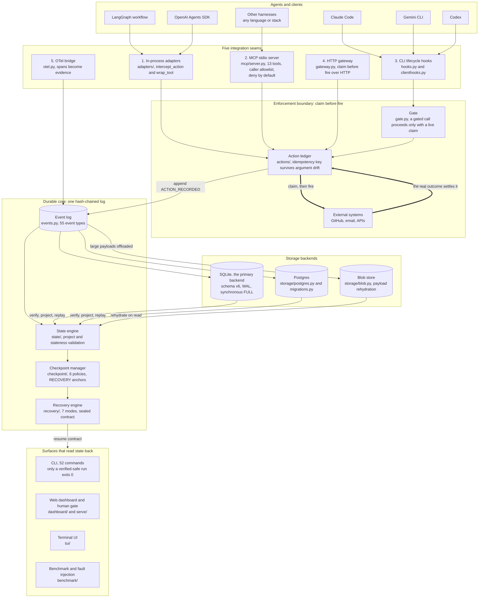
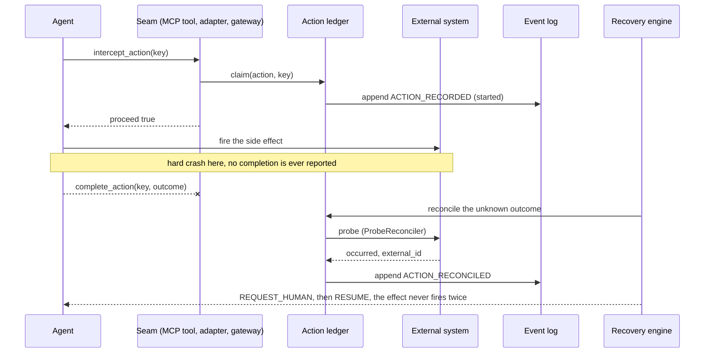

# CONTINUUM architecture

A system view of CONTINUUM: which seams a harness reaches the durable core
through, how side effects are enforced at the boundary, what happens when a
run dies mid-effect, and which surfaces read state back. Every node names the
module that implements it. Every figure on this page was re-verified against
the source the day it was written (commands in the last section).

This is the integration view. For the SDK's internal data flow see
`references/architecture-flow.md`; for the component model, the projection
semantics and the recovery context, see `references/architecture.md`; for the
rendered drawing plus the enumerated surface inventory, see
`references/architecture-diagram.md`.

## System architecture



## The claim, fire, settle lifecycle

The ledger is a two-phase protocol. A side effect is claimed before it fires
because a Python callable cannot cross the MCP boundary: `intercept_action`
answers *may I*, the caller performs the effect, `complete_action` records the
outcome. A crash between the two leaves the outcome genuinely unknown, and
that is by design, never silently completed, never retried, never dropped.



Every state component carries its origin. Facts the agent asserted about
itself (`Origin.EXTERNAL_AGENT`) land as `REQUIRES_REVIEW` until a
`REVIEW_CONFIRMED` event clears them, so progress reported through MCP cannot
self-certify a safe resume. Deterministic writer state that still matches the
environment resumes cleanly, and its exit code is 0.

## Figures on this page

| Figure | Value | Where it is asserted |
|:--|:--|:--|
| Schema version | 6 | `SCHEMA_VERSION` in `src/continuum/storage/migrations.py` |
| Event types | 55 | `EventType` in `src/continuum/events.py` |
| MCP tools | 13 total, 3 read-only (`validate`, `resume`, `list_actions`) and 10 mutating | `@server.tool(...)` decorators in `src/continuum/mcp/server.py` |
| CLI commands | 52 | `add(...)` registrations in `src/continuum/cli/main.py` |
| Recovery modes | 7, max severity wins, `RESUME` safest through `ABORT` most severe | `RecoveryMode` in `src/continuum/recovery/engine.py` |
| Checkpoint policies | 6 (`Manual`, `Interval`, `Event`, `Semantic`, `ContextPressure`, `Hybrid`) | `src/continuum/checkpoint/policy.py` |
| Storage backends | SQLite (primary) and Postgres, plus an optional blob store | `src/continuum/storage/` |

Cross-cutting modules the diagram deliberately leaves unconnected, because
they touch everything: `security/` (trust gate, revalidation, attestation),
`provenance_map.py` (origin to review), `pinning.py` and `replay_similarity.py`
(replay correctness), `budgets.py` (retry caps), `analysis/prefix_trust.py`
(advisory trust), and `concurrency/` (cross-process leases).

## Re-verify these figures

```bash
python -c "from continuum.events import EventType; print(len(EventType))"
python -c "from continuum.recovery.engine import RecoveryMode; print(list(RecoveryMode))"
grep -c "annotations=read_only" src/continuum/mcp/server.py
grep -c "annotations=mutating" src/continuum/mcp/server.py
grep -n "SCHEMA_VERSION =" src/continuum/storage/migrations.py
```

The counts in the docs are guarded by `tests/test_docs_event_counts.py` (the
event figure must follow the live enum) and `tests/test_docs_counts.py` (the
test-suite totals must agree across docs), so this page fails CI if the
figures drift from the code.
