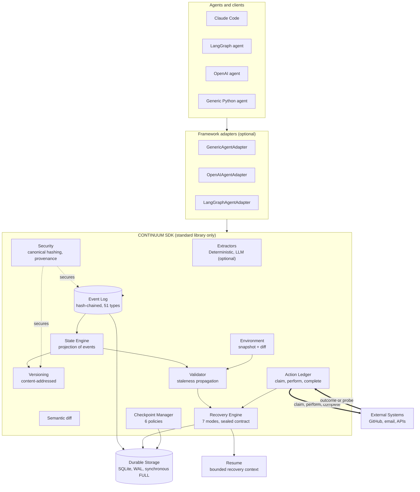

# CONTINUUM architecture flow graph

Verified Mermaid flow graph. Every node label uses the exact names from
`references/architecture-data.md` (source-checked). Render it in any Mermaid
viewer, or hand this to an image generator as the graph specification.

## Edge legend

- `Agents -> Adapters -> SDK`: the call path.
- `SDK -> Event Log -> Durable Storage`: every event is appended and persisted.
- `Event Log -> State Engine -> Versioning / Validator`: state is projected,
  versioned, and validated from the log.
- `Environment -> Validator -> Recovery Engine`: staleness drives the decision.
- `Action Ledger <-> External Systems`: two-phase side effects (thick arrows),
  reconciled when the outcome is unknown.
- `Recovery Engine -> Resume`: the single sealed next action / recovery context.
- `Security` (dotted): secures the Event Log and Versioning via canonical hashing.
